# 区块链大作业报告

> 项目地址： https://github.com/liangwj45/blockchain 

课程名称：区块链原理与技术        

任课教师：郑子彬

| 年级         | 2017级      | 专业（方向） | 软件工程                    |
| ------------ | ----------- | ------------ | --------------------------- |
| **学号**     | 16303050    | **姓名**     | 梁文杰                      |
| **电话**     | 15626405753 | **Email**    | liangwj45@mail2.sysu.edu.cn |
| **开始日期** | 2019.10.20  | **完成日期** | 2019.12.13                  |

## 一、项目背景

某车企（宝马）因为其造车技术特别牛，消费者口碑好，所以其在同行业中占据绝对优势地位。因此，在金融机构（银行）对该车企的信用评级将很高，认为他有很大的风险承担的能力。在某次交易中，该车企从轮胎公司购买了一批轮胎，但由于资金暂时短缺向轮胎公司签订了1000万的应收账款单据，承诺1年后归还轮胎公司1000万。这个过程可以拉上金融机构例如银行来对这笔交易作见证，确认这笔交易的真实性。在接下里的几个月里，轮胎公司因为资金短缺需要融资，这个时候它可以凭借跟某车企签订的应收账款单据向金融结构借款，金融机构认可该车企（核心企业）的还款能力，因此愿意借款给轮胎公司。但是，这样的信任关系并不会往下游传递。在某个交易中，轮胎公司从轮毂公司购买了一批轮毂，但由于租金暂时短缺向轮胎公司签订了500万的应收账款单据，承诺1年后归还轮胎公司500万。当轮毂公司想利用这个应收账款单据向金融机构借款融资的时候，金融机构因为不认可轮胎公司的还款能力，需要对轮胎公司进行详细的信用分析以评估其还款能力同时验证应收账款单据的真实性，才能决定是否借款给轮毂公司。这个过程将增加很多经济成本，而这个问题主要是由于该车企的信用无法在整个供应链中传递以及交易信息不透明化所导致的。因此希望通过设计一个信息透明化的区块链应用来解决以上案例的问题。

## 二、方案设计

区块链+供应链金融：将供应链上的每一笔交易和应收账款单据上链，同时引入第三方可信机构来确认这些信息的交易，例如银行，物流公司等，确保交易和单据的真实性。同时，支持应收账款的转让，融资，清算等，让核心企业的信用可以传递到供应链的下游企业，减小中小企业的融资难度。

### 实现功能

功能一：实现采购商品—签发应收账款交易上链。例如车企从轮胎公司购买一批轮胎并签订应收账款单据。

功能二：实现应收账款的转让上链，轮胎公司从轮毂公司购买一笔轮毂，便将于车企的应收账款单据部分转让给轮毂公司。轮毂公司可以利用这个新的单据去融资或者要求车企到期时归还钱款。

功能三：利用应收账款向银行融资上链，供应链上所有可以利用应收账款单据向银行申请融资。

功能四：应收账款支付结算上链，应收账款单据到期时核心企业向下游企业支付相应的欠款。 

### 存储设计

项目的初衷是提供一个交易记录查询的平台，仅存储用户的公钥地址信息，来对特定用户进行查询。对于交易的发起，用户使用客户端对调用的合约函数及参数进行签名，将签名由前端发送到后端进行执行。在整个交易的过程，平台所有的操作均不涉及用户的私钥，以确保用户信息的保密性。

但限于课程作业完成的时间，最终实现为由后端存储用户的公钥和密钥，并存储用户的用户名及密码，以及用户所对应的公钥地址信息。

#### 平台数据库

因此，平台数据库共有三个表。

```mysql
drop database blockchain;
create database blockchain;
use blockchain

-- user 
drop table user;
create table user(
  username char(20) not null,
  passwd char(255) not null,
  primary key(username)
) charset=utf8;


-- public key
drop table publicKey;
create table publicKey(
  username char(20) not null,
  publicKey char(160) not null
) charset=utf8;


-- private key
drop table pri_keys;
create table pri_keys(
  pub char(160) not null,
  pri text(500) not null,
  primary key(pub)
) charset=utf8;
```

#### 合约数据库

对于合约部分的数据存储，使用 solidity 语言中内置的 storage 特性来对数据进行持久化。存储的数据包括用户的资产数额，应收账款明细（分别包括作为债权人和债务人的两份表），使用 mapping 的数据结果对公钥地址到应收账款明细表的映射。

```javascript
struct Table {
    bool is_valid;
    address[] addrs;      // 存储公钥地址
    uint256[] amounts;    // 存储应收账款数额
    uint256[] deadlines;  // 存储还款日期
}

mapping(address => Table) receipts_creditor;  // 记录债权人的应收账款列表
mapping(address => Table) receipts_debtor;    // 记录债务人的账单列表
mapping(address => uint256) assets;           // 记录用户资产数额
```

### 核心功能介绍

#### 签发应收账款

分别记录债权人的应收账款列表和债务人的账单列表。tableInsert 是自己实现的一个更新映射表的函数。

```javascript
// 签发应收账款单据
function signature(address debtor, uint256 amount, uint256 deadline) public {
    // insert creditor receipt
    Table storage table_creditor = receipts_creditor[msg.sender];
    tableInsert(table_creditor, debtor, amount, deadline);
    // insert debtor receipt
    Table storage table_debtor = receipts_debtor[debtor];
    tableInsert(table_debtor, msg.sender, amount, deadline);

    emit SignatureEvent(msg.sender, debtor, amount, deadline);
}
```

#### 转让应收账款

债权人将应收账款单据部分或全部转让给第三方，转让需要确保单据存在，并且转让数额不大于原单据数额，转让完成后将更新原单据数额，并添加新的应收账款单据。

```javascript
// 转让应收账款
// a->c => b->c
function transfer(address creditor, address debtor, uint256 amount) public {
    Table storage table_sender = receipts_creditor[msg.sender];
    Table storage table_middle = receipts_creditor[creditor];
    Table storage table_debtor = receipts_debtor[debtor];

    bool exist;
    uint256 receipt_amount;
    uint256 deadline;

    (exist, receipt_amount, deadline) = getAmountAndDeadline(table_sender, debtor);

    require(exist, "receipt not exist");
    require(receipt_amount >= amount, "receipt not enough");
    tableDelete(table_sender, debtor);
    tableDelete(table_debtor, msg.sender);
    tableInsert(table_middle, debtor, amount, deadline);
    tableInsert(table_debtor, creditor, amount, deadline);
    if (receipt_amount > amount) {
        tableInsert(table_sender, debtor, receipt_amount - amount, deadline);
        tableInsert(table_debtor, msg.sender, receipt_amount - amount, deadline);
    }

    emit TransferEvent(msg.sender, creditor, debtor, amount);
}
```

#### 向银行融资

债权人使用应收账款单据凭证向银行融资，能够向银行借取不大于应收账款单据面额的资产。融资操作完成后将添加一个新的应收账款单据，表示债权人向银行融资的证明，最后更新债权人和银行的资产数额。

```javascript
// 向银行融资
function finance(address bank, address debtor, uint256 amount, uint256 deadline) public {
    Table storage table_sender_c = receipts_creditor[msg.sender];
    Table storage table_sender_d = receipts_debtor[msg.sender];
    Table storage table_bank = receipts_creditor[bank];
    Table storage table_debtor = receipts_debtor[debtor];

    bool exist;
    uint256 receipt_amount;
    (exist, receipt_amount) = getAmount(table_sender_c, debtor);
    require(exist, "receipt not exist");
    require(receipt_amount >= amount, "receipt not enough");
    require(assets[bank] >= amount, "bank account not enough");
    tableInsert(table_bank, msg.sender, amount, deadline);
    tableInsert(table_sender_d, bank, amount, deadline);
    assets[msg.sender] += amount;
    assets[bank] -= amount;

    emit FinanceEvent(msg.sender, bank, debtor, amount, deadline);
}
```

#### 还款

债务人向债权人还款，更新债务人和债权人的资产数额。

```javascript
// 还款
function payback(address creditor) public {
    Table storage table_creditor = receipts_creditor[creditor];
    Table storage table_debtor = receipts_debtor[msg.sender];

    bool exist;
    uint256 amount;
    (exist, amount) = getAmount(table_creditor, msg.sender);
    require(exist, "receipt not exist");
    require(assets[msg.sender] > amount, "account not enough");
    tableDelete(table_creditor, msg.sender);
    tableDelete(table_debtor, creditor);
    assets[msg.sender] -= amount;
    assets[creditor] += amount;

    emit PaybackEvent(msg.sender, creditor, amount);
}
```

#### 查询资产

查询用户资产。

```javascript
// 获取账户余额
function getAsset() public constant returns(uint256) {
    return assets[msg.sender];
}
```

#### 添加资产

向账户添加资产。

```javascript
// 添加资产
function addAsset(uint256 amount) public {
    assets[msg.sender] += amount;
    emit AddAssetEvent(msg.sender, amount);
}
```

#### 查询账单列表

分为两种账单，一个是作为债权人的应收账款单据列表，另一个是作为债务人的应收账款单据列表。

查询用户所持有的应收账款单据列表，返回该用户的公钥地址，单据列表中的公钥地址以逗号分隔的字符串形式返回，单据数额和还款日期以整型数组的形式返回。

```javascript
// 获取收据列表
function getCreditorReceipts() public constant returns(string, string, uint256[], uint256[]) {
    Table storage table = receipts_creditor[msg.sender];
    string memory addrs = new string(0);
    uint256[] memory amounts = table.amounts;
    uint256[] memory deadlines = table.deadlines;
    for (uint256 i = 0; i < table.addrs.length; i++) {
        addrs = strConcat(addrs, toString(table.addrs[i]));
        addrs = strConcat(addrs, ",");
    }
    return (toString(msg.sender), addrs, amounts, deadlines);
}

// 获取欠据列表
function getDebtorReceipts() public constant returns(string, string, uint256[], uint256[]) {
    Table storage table = receipts_debtor[msg.sender];
    string memory addrs = new string(0);
    uint256[] memory amounts = table.amounts;
    uint256[] memory deadlines = table.deadlines;
    for (uint256 i = 0; i < table.addrs.length; i++) {
        addrs = strConcat(addrs, toString(table.addrs[i]));
        addrs = strConcat(addrs, ",");
    }
    return (toString(msg.sender), addrs, amounts, deadlines);
}
```

## 三、功能测试

设置有4个用户，分别为：bank，companyA，companyB 和 factory。

### 公钥地址

- bank：0x07a1227f2d5eab54d0dcd9c6897aa3bf2e970955
- companyA：0x7b5d75c825301ee4a10c86f4f7fb96ec16e3c5be
- companyB：0x16f09cc32b772077acfa78b9e4abfec6b4aedc26
- factory：0x144d5ca47de35194b019b6f11a56028b964585c9

### 初始资产

- bank：1000000000000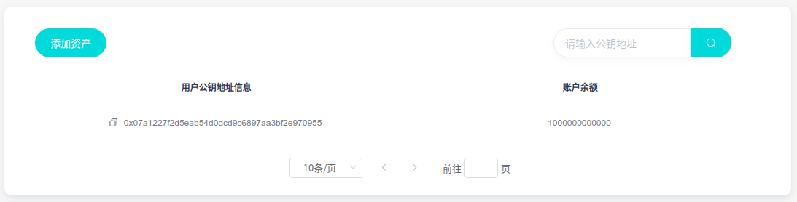
- companyA：5000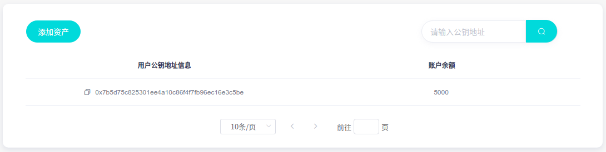
- companyB：13000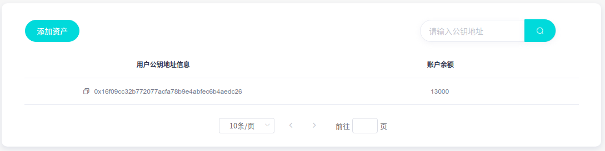
- factory：7000

### 1. 添加账单（companyA -> companyB）

companyA(债务人) 向 companyB(债权人) 签发应收账款单据 8000。

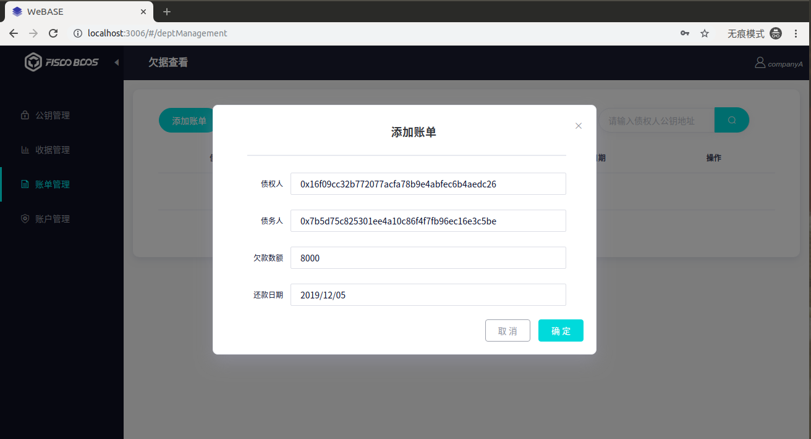

#### 查看账单（companyA）


#### 查看收据（companyB）


### 2. 融资（companyB -> bank）

companyB 使用 companyA 向自己签发的应收账款单据向 bank 融资 5000。

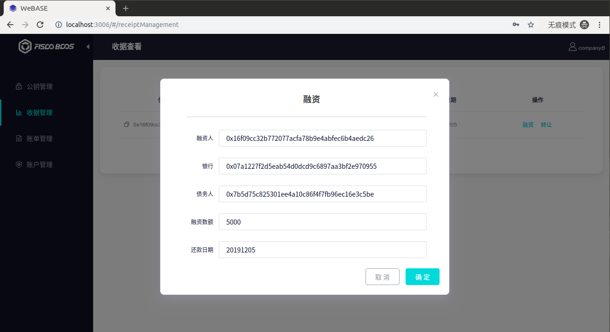

#### 查看账单（companyB）

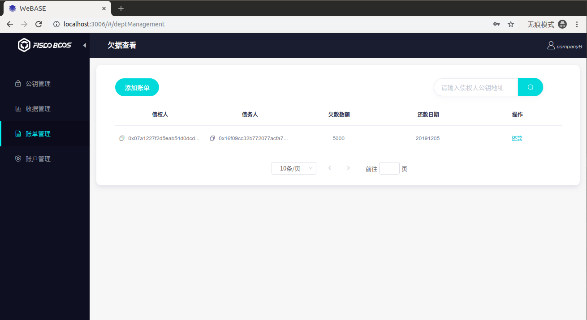

#### 查看账户余额（companyB）

账户余额多了 5000，当前为 18000。


### 3. 转让（companyB -> factory）

companyB 将 companyA 向自己签发的应收账款单据转让 5000 给 factory。

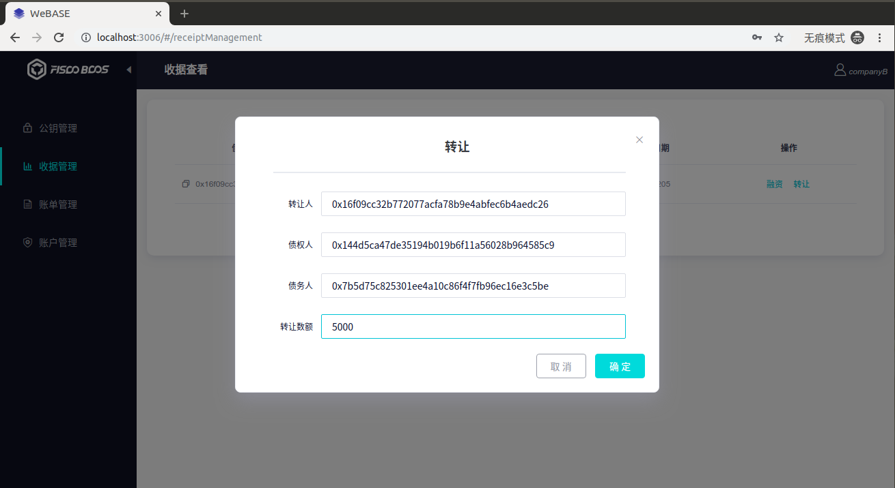

#### 查看收据（companyB）

单据数额少量 5000，剩余 3000。

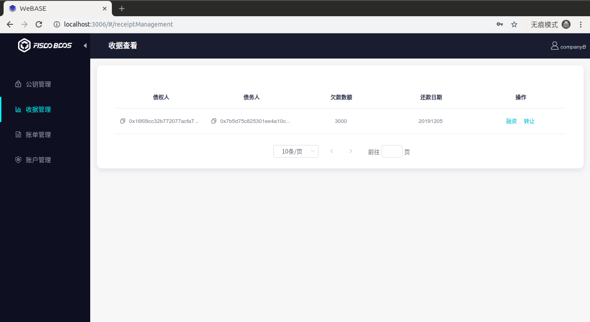

#### 查看收据（factory）


factory 多了一条由 companyA 发起的应收账款单据，数额为 5000。

#### 查看账单（companyA）

由一条记录变成了两条记录。

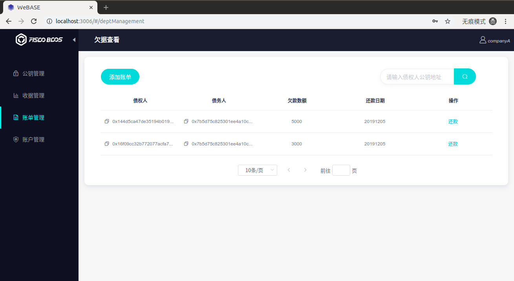

### 4. 添加资产（companyA）

companyA 通过某种方式注入 10000 资产。

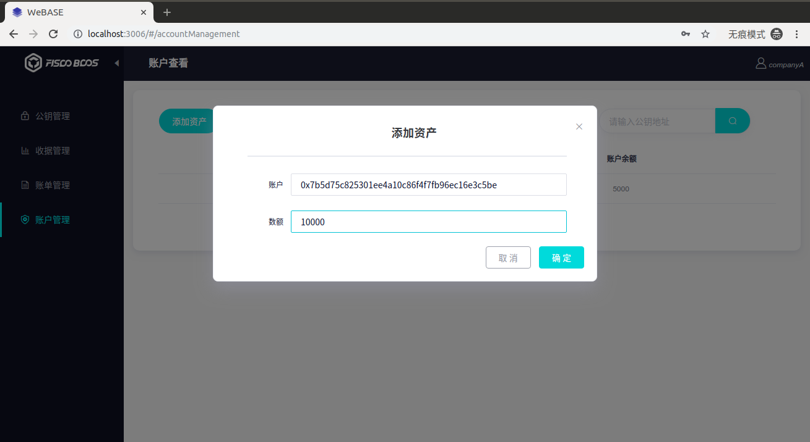

#### 查看余额（companyA）

增加了 10000，当前余额为 15000。


### 5. 还款（companyA -> companyB/factory）

companyA 向 companyB 以及 factory 还款（点击账单条目右边的“还款”按钮）。


#### 查看余额（companyA）

减少了 8000，当前余额为 7000。


#### 查看余额（companyB）

增加了 3000，当前余额为 21000。


#### 查看余额（factory）

增加了 5000，当前余额为 12000。

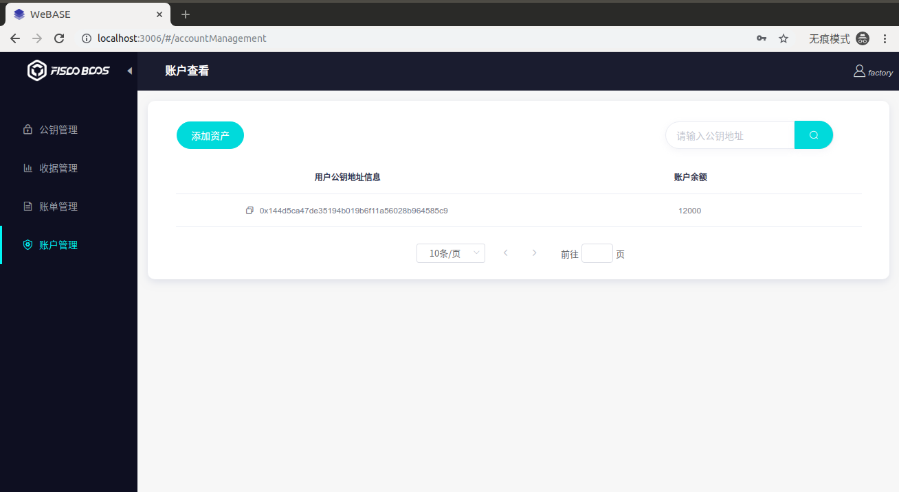

### 6. 还款（companyB -> bank）

companyB 向 bank 还款。


#### 查看余额（companyB）

减少了 5000，当前余额为 16000。


#### 查看余额（bank）

余额恢复为原来的数额，保持不变。


## 四、界面展示

### 登录界面

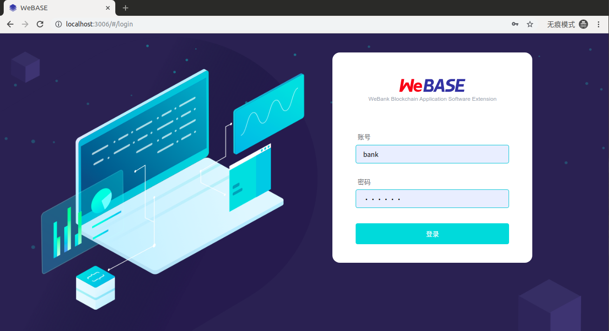

### 公钥管理


### 收据管理


### 账单管理


### 账户管理


### 转让界面


### 融资界面


## 五、心得体会

solidity 语言虽然也算是图灵完备的语言，对区块链应用来说是一个很大的进步，但相比其他成熟的高级语言还是差太多了，在智能合约的编写上限制较多，比如想要返回一个结构体数组，或者是 string 数组，都是不行的，最后唯有另找它径，通过结构体拆解或者字符串拼接等方式解决。

整个项目做下来，对区块链应用的了解又加深了。从智能合约的编写，到 sdk 源码的阅读，api，abi 接口的使用，再到交易接口的实现、封装，一步步打开了区块链的大门。

在本次项目的过程中，可以说收获相当丰富，不仅对区块链底层知识更加牢固，对区块链应用更加熟悉，对前后端的项目开发也积累了经验。虽然项目已经完成了，但仍然有比较多的地方可以有改进，如果以后还有机会接触类似的区块链应用，或许会继续改善该项目。

总的来说，本实验顺利完成。